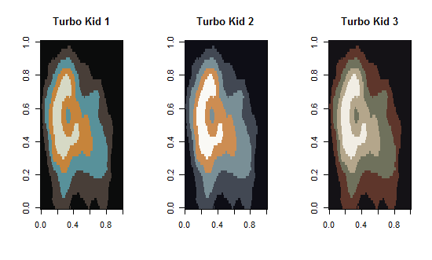

Fun R Palettes
================

-   [South Park](#south-park)
-   [Turbo Kid](#turbo-kid)
-   [Marvel](#marvel)
-   [Beavis and Butthead](#beavis-and-butthead)
-   [Friday the 13th](#friday-the-13th)


Package Description
-------------------

This package is for picking fun palettes to use in R.  It is nothing more than an assortment of goofy things that I enjoy. There are only two real functions (**showFunPals** & **funPalPicker**), but you can hopefully get some enjoyment out of seeing some of the palettes.  The **funPalPicker** function is an gadget that will open in your RStudio Viewer pane.

Installation
------------

```{r}
devtools::install_github('saberry/Fun-R-Palettes')
```

South Park
----------


These are palettes derived from the main characters in South Park and from the closing credits.


Turbo Kid
---------


Turbo Kid is an awesome movie.  If you have not seen it, I recommend you do so.  Some people say that you can sync it up with Lazerhawk's "Redline" album, but I am never sure when to take the cassette off pause.



Marvel
------


Because a 5-year-old demands it to be so.


Beavis and Butthead
-------------------


You probably won't get hurt, expelled, arrested, or deported for using this palette, but you might end up watching a few episodes.


Friday the 13th
---------------

### Coming Soon ###

These palettes will be derived from a collection of Friday the 13th movie posters.