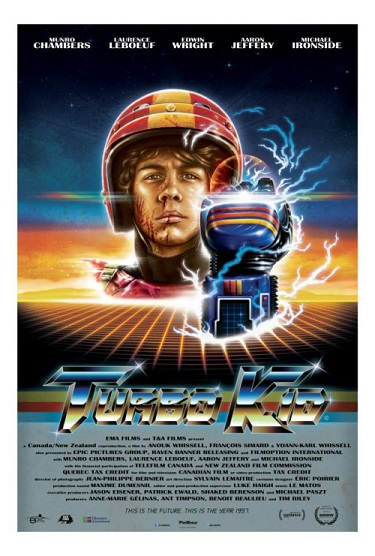

Fun R Palettes
================

-   [South Park](#south-park)
-   [Turbo Kid](#turbo-kid)
-   [Marvel](#marvel)
-   [Beavis and Butthead](#beavis-and-butthead)
-   [Friday the 13th](#friday-the-13th)

This package is for extracting color palettes from various images.

South Park
----------

There will be palettes derived from the main characters in South Park and from the closing credits.

Turbo Kid
---------

Marvel
------

Because a 5-year-old demands it to be so.

Beavis and Butthead
-------------------

You probably won't get hurt, expelled, arrested, or deported for using this palette, but you might end up watching a few episodes.

Friday the 13th
---------------

### Coming Soon ###

These palettes will be derived from a collection of Friday the 13th movie posters.